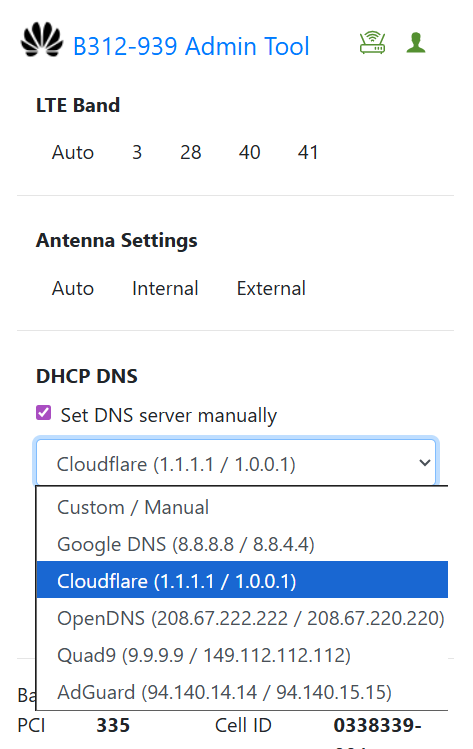
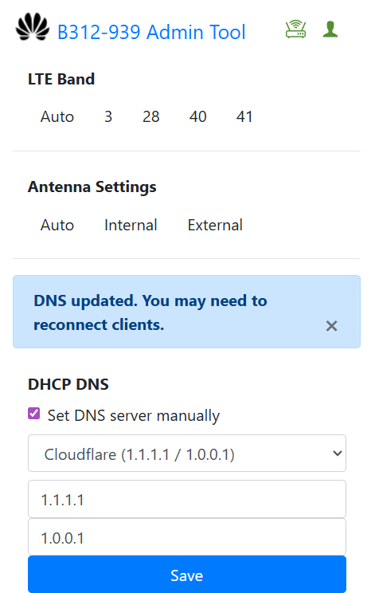

# B312-939 Admin Tool

  
  &nbsp;
  

A Chrome Extension that lets users manually set the **LTE band**, **antenna settings**, and now **custom DNS** of the Huawei **B312-939** modem **without admin access**.

Originally created by **Chris Laconsay**.  
Extended and improved by **RDevz PH**.

---

> [!NOTE]
> **Project Status (IMPORTANT)**  
>  
> This is the **final version** of the B312-939 Admin Tool.  
> **No future updates, bug fixes, or new features** will be released.  
>  
> The project is considered **complete**, stable for its purpose,  
> and will remain available **as-is**.

---

## New in This Update (by RDevz PH)

### Added DHCP / DNS Configuration
You can now set **custom DNS servers** directly through the tool.

- Full support for `/api/dhcp/settings` updating  
- Auto-detects current DNS  
- Includes DNS provider presets:
  - **Google DNS** – 8.8.8.8 / 8.8.4.4
  - **Cloudflare** – 1.1.1.1 / 1.0.0.1
  - **OpenDNS** – 208.67.222.222 / 208.67.220.220
  - **Quad9** – 9.9.9.9 / 149.112.112.112
  - **AdGuard DNS** – 94.140.14.14 / 94.140.15.15
- Manual DNS input supported
- DNS UI section only appears when the API is available

### Additional Enhancements
- Added a full DHCP/DNS UI section  
- Automatic token retrieval for DNS updates  
- Streamlined form actions & alert handling  
- Clean integration with existing band and antenna features

---

## Installation

Follow the original installation video:

https://www.youtube.com/watch?v=buFtv9XOOd8

## Preview

https://www.youtube.com/watch?v=buFtv9XOOd8

---

## How to Use

1. Follow the installation video to install the tool.  
2. Log in to the router (`192.168.254.254`) using the default **user** account.  
3. Ensure the *Router* and *User* icons are **green** to confirm connection.  
4. **Band Locking**
   - Test each band one by one  
   - Run a speed test after each change  
   - Choose the strongest and most stable band  
5. **DNS Configuration**
   - Select a DNS preset *or* enter custom DNS addresses  
   - Click **Save**  
   - Reconnect devices if necessary

---

> [!WARNING]
> I do **NOT** provide **FREE ADMIN ACCESS**.  
> This tool is solely for **band selection**, **antenna control**, and **DNS configuration** using **default Globe user access**.  
>   
> **Important reminders:**  
> - Signal loss when switching bands is **normal**  
> - This also occurs in the legitimate admin interface  
> - Globe maintenance may cause temporary signal drops  
> - Signal may return quickly or require a modem reboot/reset  
> - Use this tool only if you understand the risks  
> - Read the [`LICENSE`](LICENSE) before using

---

## Credits

### Original Author  
**Chris Laconsay**  
Creator of the original B312 Band & Antenna Tool  
Source: https://github.com/arielmagbanua/adminer

### DNS + Feature Enhancements  
**RDevz PH**  
Added DHCP/DNS feature, presets, API logic, UI updates, and improvements
